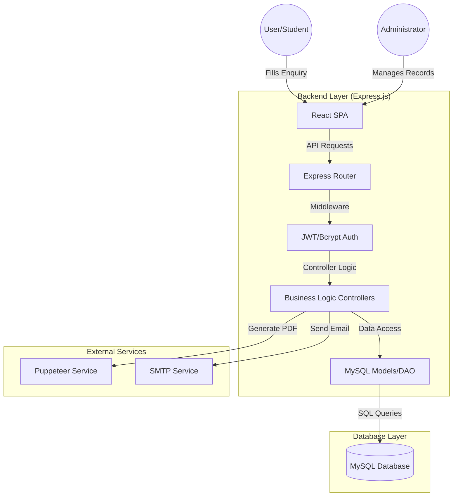
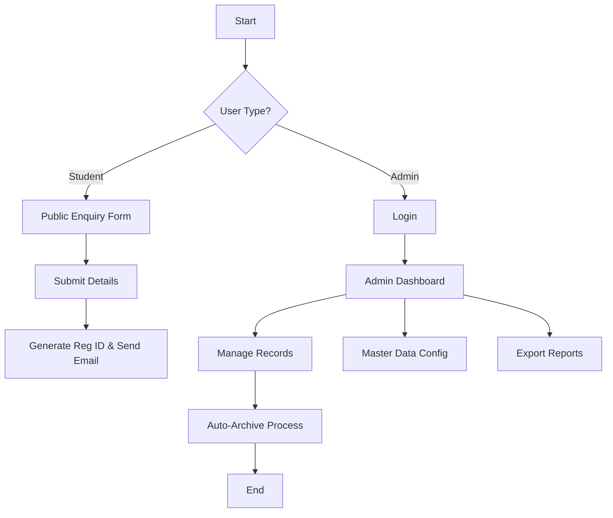
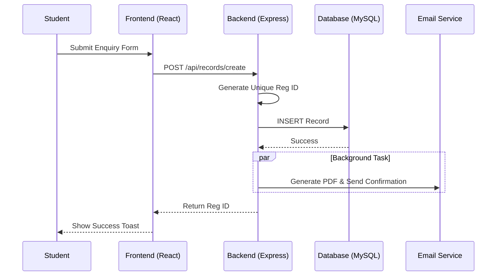
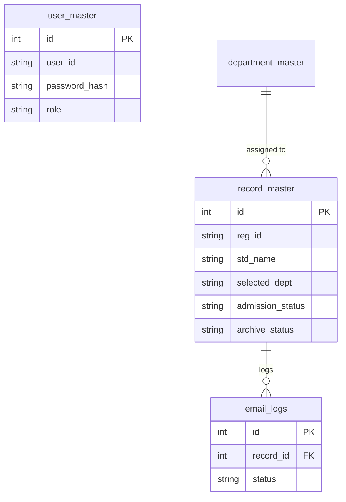
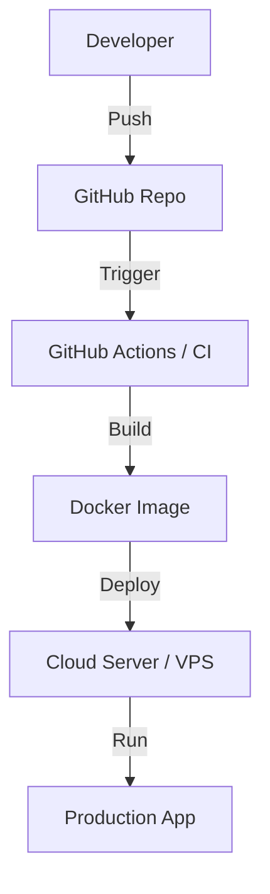

# 🚀 Admission Portal - NextGen Enrollment Management System

[](https://nodejs.org/)
[](https://reactjs.org/)
[](https://www.mysql.com/)
[](https://expressjs.com/)
[](https://vitejs.dev/)

A professional, high-performance, and secure admission management system designed to streamline the student enrollment process for educational institutions.

---

## 📖 Overview

The **Admission Portal** is a production-grade solution for managing the end-to-end admission lifecycle. From initial student enquiries to final admission status tracking, this system provides a centralized platform for administrators to manage departments, communities, and enrollment data with precision.

### 🌟 Key Value Proposition
- **Automated Workflow**: Reduces manual effort through intelligent auto-archiving and email notifications.
- **Data Integrity**: Enforces strict master data management for consistent reporting.
- **Recruiter-Ready Architecture**: Built with modern engineering standards (RESTful APIs, JWT Auth, Clean Architecture).

---

## 🧠 System Architecture

### 📊 Architecture Diagram


### 🏗️ Explanation
- **Frontend**: A highly responsive React application bundled with Vite for lightning-fast performance.
- **Backend**: A modular Express.js monolith following the Controller-Service-Model pattern.
- **Database**: Relational MySQL schema optimized for complex queries and data integrity.
- **Scaling**: Designed for horizontal scaling of the backend and optimized DB connection pooling.

---

## 🔄 Application Flow

### 📌 Flowchart


### 🔁 Sequence Diagram


---

## 🧩 Module Breakdown

| Module | Description |
| :--- | :--- |
| **Public Enquiry** | Accessible to students to register their interest with automated ID generation. |
| **Admin Dashboard** | Real-time analytics and statistics of total enquiries, admissions, and archived data. |
| **Master Management** | Dynamic CRUD for Departments, Communities, Admission Statuses, and Study Levels. |
| **Automated Archiving**| Configurable rules to move stale enquiries to archives based on "Days Limit". |
| **Email Logs** | Comprehensive tracking of all automated communications with status monitoring. |
| **Reporting** | High-quality Excel exports and PDF generation for student records. |

---

## ✨ Features

- 🛡️ **JWT Authentication**: Secure admin access with encrypted password hashing (Bcrypt).
- 🔄 **Auto-Archiving**: Intelligent cleanup of old records based on administrative settings.
- 📧 **Automated Notifications**: Sends PDF enquiries to designated staff emails automatically.
- 📊 **Dynamic Reporting**: One-click Excel export for all student data.
- ⚡ **Responsive UI**: Built with CSS Modules for scoped, performant styling across all devices.
- 🔍 **Advanced Filtering**: Search and filter records by date, status, department, and more.

---

## 🧰 Tech Stack

- **Frontend**: `React 19`, `React Router 7`, `Lucide Icons`, `Axios`.
- **Backend**: `Node.js`, `Express 5`, `MySQL2 (Promise based)`.
- **Utilities**: `Puppeteer` (PDF Gen), `Nodemailer` (Email), `XLSX` (Excel Exports).
- **Security**: `JSON Web Tokens`, `Bcrypt`.
- **Styling**: `Vanilla CSS Modules` (Professional, Scoped, High Performance).

---

## 📂 Project Structure

```text
admission_portal/
├── client/                 # React Frontend (Vite)
│   ├── src/
│   │   ├── components/     # Reusable UI components
│   │   │   └── css/        # Scoped CSS Modules
│   │   ├── pages/          # Admin & Public Pages
│   │   ├── services/       # API abstraction layer
│   │   └── utils/          # Helper functions
├── server/                 # Express Backend
│   ├── config/             # Database & SMTP configs
│   ├── controllers/        # Request handlers
│   ├── models/             # Database interaction logic
│   ├── routes/             # API endpoint definitions
│   ├── services/           # PDF & Email business logic
│   └── init_db.js          # Database schema & seed script
```

---

## ⚙️ Installation & Setup

### 🖥️ System Requirements
- **Node.js**: v18.x or higher
- **MySQL**: v8.x
- **OS**: Windows / Linux / Mac

### 🔧 Step-by-Step Setup

1. **Clone the Repository**
   ```bash
   git clone https://github.com/your-username/admission-portal.git
   cd admission_portal
   ```

2. **Backend Setup**
   ```bash
   cd server
   npm install
   ```
   - Create a `.env` file in `server/` with:
     ```env
     PORT=5000
     DB_HOST=localhost
     DB_USER=root
     DB_PASS=your_password
     DB_NAME=admission_portal
     JWT_SECRET=your_super_secret_key
     EMAIL_USER=your_email@gmail.com
     EMAIL_PASS=your_app_password
     ```
   - Initialize Database:
     ```bash
     node init_db.js
     ```

3. **Frontend Setup**
   ```bash
   cd ../client
   npm install
   ```

### ▶️ Run Commands
- **Development**:
  - Server: `npm run dev` (in `/server`)
  - Client: `npm run dev` (in `/client`)
- **Production**:
  - `npm run build` (in `/client`)
  - `npm start` (in `/server`)

---

## 🧹 Project Optimization सुझाव (Improvements)

> [!IMPORTANT]
> Based on a deep audit of the codebase, the following optimizations are recommended for production scalability.

### 1. Architectural Cleanup
- **❌ Remove Redundant Calls**: `Record.autoArchive()` is currently called on every `getRecords` request. 
- **✅ Suggested**: Move this to a **Cron Job** (using `node-cron`) to run once daily at midnight.
- **📂 Folder Restructuring**: Move CSS Modules from `client/src/components/css/` to the respective component folders for better modularity.

### 2. Performance Enhancements
- **🚀 Database Indexing**: Add indexes on `reg_id`, `std_mobile_no`, and `admission_date_time` in `record_master` to speed up search queries.
- **⚡ Connection Pooling**: Ensure the MySQL pool limit is tuned based on server RAM (currently set to 10).

### 3. Security Hardening
- **🔒 Input Validation**: Implement `express-validator` to sanitize user inputs and prevent SQL injection/XSS.
- **🔑 Password Policy**: Update the default `Admin@12345` password in `init_db.js` to a more complex string and implement password expiry.
- **🌐 CORS Policy**: Restrict CORS origins to the specific frontend URL in production.

---

## 🗄️ Database Design

### 📊 ER Diagram


---

## 🚀 DevOps & Deployment

### ⚙️ Deployment Strategy
